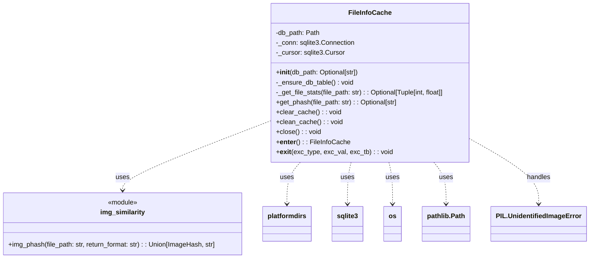

# Plan for FileInfoCache Implementation

This document outlines the plan for implementing the `FileInfoCache` manager as discussed.

## 1. Evaluation of Proposed Design & Suggested Improvements

The initial design proposed in `tasks/file-info-cache.md` is largely sound. The following points summarize the evaluation and agreed-upon refinements:

*   **Core Functionality:**
    *   Keying by full file system path is appropriate.
    *   Storing file size and modification date for cache invalidation is correct.
    *   The logic for `get_phash` (checking cache, validating, generating/updating phash) is well-defined.
    *   Utility methods `clear_cache` and `clean_cache` are useful.

*   **Database Path (Improvement):**
    *   Instead of a relative path (`./db/file_info_cache.db`), the cache will use a user-specific application data directory determined by the `platformdirs` library.
    *   Example path: `platformdirs.user_data_dir("img-ops", "pkirkaas") / "file_info_cache.db"`.
    *   The `FileInfoCache` class will ensure this directory exists upon initialization.

*   **Error Handling in `get_phash` (Refinement):**
    *   `get_phash` will gracefully handle exceptions from `img_similarity.img_phash` (e.g., `FileNotFoundError`, `PIL.UnidentifiedImageError`).
    *   If phash generation fails, `None` will be returned by `get_phash`, and `NULL` will be stored in the `phash` column in the database for that entry. This prevents repeated attempts on known non-images or problematic files if their size/timestamp haven't changed.

*   **SQLite Schema (Clarification):**
    *   The database table (e.g., `file_cache`) will have the following schema:
        *   `file_path TEXT PRIMARY KEY`
        *   `size INTEGER NOT NULL`
        *   `mod_time REAL NOT NULL` (Unix timestamp, floating point for sub-second precision)
        *   `phash TEXT` (stores the hex string of the phash, can be `NULL`)

*   **Initialization:**
    *   The `FileInfoCache` constructor will ensure the database file and the `file_cache` table are created if they don't already exist.

*   **`clean_cache` Behavior:**
    *   The `clean_cache` method will iterate through all entries. If a file path no longer exists, or if its modification date or size differs from the cached values, the entry will be removed from the cache.

## 2. Detailed Implementation Plan

### 2.1. File Creation
*   New file: `src/img_ops/core/file_info_cache.py`

### 2.2. Class Definition: `FileInfoCache`

```python
import sqlite3
import os
from pathlib import Path
from typing import Optional, Tuple, Union
from PIL import UnidentifiedImageError # For type hinting in error handling
import platformdirs
from ..img_similarity import img_phash # Assuming img_similarity is in the same 'core' package

class FileInfoCache:
    # ... (implementation details below) ...
```

*   **`__init__(self, db_path: Optional[str] = None)`:**
    *   Determine database path:
        *   If `db_path` is provided, use `Path(db_path)`.
        *   Else, default to `Path(platformdirs.user_data_dir("img-ops", "pkirkaas")) / "file_info_cache.db"`.
    *   Store this as `self.db_path`.
    *   Create the parent directory of `self.db_path` if it doesn't exist (`self.db_path.parent.mkdir(parents=True, exist_ok=True)`).
    *   Initialize `sqlite3` connection: `self._conn = sqlite3.connect(self.db_path)`.
    *   Initialize cursor: `self._cursor = self._conn.cursor()`.
    *   Call `self._ensure_db_table()`.

*   **`_ensure_db_table(self)`:**
    *   Executes SQL:
      ```sql
      CREATE TABLE IF NOT EXISTS file_cache (
          file_path TEXT PRIMARY KEY,
          size INTEGER NOT NULL,
          mod_time REAL NOT NULL,
          phash TEXT
      );
      ```
    *   Commits the change.

*   **`_get_file_stats(self, file_path: str) -> Optional[Tuple[int, float]]`:**
    *   Takes a `file_path` string.
    *   Uses `os.stat(file_path)` to get `st_size` and `st_mtime`.
    *   Returns `(size, mod_time)` tuple.
    *   Returns `None` if `FileNotFoundError` occurs.

*   **`get_phash(self, file_path: str) -> Optional[str]`:**
    *   Normalize `file_path`: `abs_file_path = str(Path(file_path).resolve())`.
    *   Get current file stats: `current_stats = self._get_file_stats(abs_file_path)`.
    *   If `current_stats` is `None` (file doesn't exist), return `None`.
    *   `current_size, current_mod_time = current_stats`.
    *   Query DB: `SELECT size, mod_time, phash FROM file_cache WHERE file_path = ?`, with `(abs_file_path,)`.
    *   `cached_entry = self._cursor.fetchone()`.
    *   If `cached_entry` exists:
        *   `cached_size, cached_mod_time, cached_phash = cached_entry`.
        *   If `cached_size == current_size` and `cached_mod_time == current_mod_time` and `cached_phash is not None`:
            *   Return `cached_phash`.
    *   (Cache miss or invalidation):
        *   `new_phash_val: Optional[str] = None`
        *   `try:`
            *   `new_phash_val = img_phash(abs_file_path, return_format='hex')`
        *   `except (FileNotFoundError, UnidentifiedImageError, Exception) as e:`
            *   `# Log error (optional)`
            *   `new_phash_val = None`
        *   If `cached_entry` existed (update):
            *   `UPDATE file_cache SET size = ?, mod_time = ?, phash = ? WHERE file_path = ?`
            *   Parameters: `(current_size, current_mod_time, new_phash_val, abs_file_path)`
        *   Else (no DB entry, insert):
            *   `INSERT INTO file_cache (file_path, size, mod_time, phash) VALUES (?, ?, ?, ?)`
            *   Parameters: `(abs_file_path, current_size, current_mod_time, new_phash_val)`
        *   `self._conn.commit()`.
        *   Return `new_phash_val`.

*   **`clear_cache(self)`:**
    *   `DELETE FROM file_cache`.
    *   `self._conn.commit()`.

*   **`clean_cache(self)`:**
    *   `SELECT file_path, size, mod_time FROM file_cache`.
    *   `all_entries = self._cursor.fetchall()`.
    *   `paths_to_delete = []`.
    *   For each `(path, cached_size, cached_mod_time)` in `all_entries`:
        *   `current_stats = self._get_file_stats(path)`.
        *   If `current_stats is None` (file deleted) OR `current_stats[0] != cached_size` OR `current_stats[1] != cached_mod_time`:
            *   Add `path` to `paths_to_delete`.
    *   If `paths_to_delete`:
        *   `DELETE FROM file_cache WHERE file_path IN ({','.join(['?']*len(paths_to_delete))})`
        *   Execute with `paths_to_delete`.
        *   `self._conn.commit()`.

*   **`close(self)`:**
    *   `if self._conn: self._conn.close()`.

*   **Context Manager Support:**
    *   **`__enter__(self)`:** `return self`
    *   **`__exit__(self, exc_type, exc_val, exc_tb)`:** `self.close()`

### 2.3. Imports
```python
import sqlite3
import os
from pathlib import Path
from typing import Optional, Tuple, Union # Union might not be strictly needed if get_phash always returns Optional[str]
from PIL import UnidentifiedImageError # For type hinting
import platformdirs
# Assuming img_similarity.py is in the same package (e.g., src.img_ops.core)
# Adjust the import based on your actual project structure if needed.
# from ..img_similarity import img_phash
# If file_info_cache.py is directly in src/img_ops/core:
from .img_similarity import img_phash
```

## 3. Mermaid Diagram



This plan should provide a solid foundation for implementing the `FileInfoCache`.