# Img-Ops Project: Folder Structure Plan

This document outlines the approved folder structure for the `img-ops` project, designed to support modularity, scalability, testability, and maintainability through iterative development.

## Recommended Structure (Refined Layered Approach)

The following structure is based on a refined layered approach, separating core logic from presentation layers (CLI and GUI) and providing clear organization within the core functionalities.

```
src/
└── img_ops/                     # Main application package
    ├── __init__.py              # Manages package exports
    │
    ├── core/                    # Core logic, domain models, business rules
    │   ├── __init__.py
    │   ├── image_processing.py  # Image manipulation, analysis functions
    │   ├── file_system.py       # File/directory operations, scanning
    │   ├── metadata.py          # EXIF, IPTC handling
    │   ├── comparison.py        # Logic for comparing images
    │   ├── models.py            # Core data structures (e.g., ImageFile, ConfigData)
    │   ├── config_manager.py    # Loading/saving application configuration
    │   └── exceptions.py        # Custom exceptions for the core logic
    │
    ├── cli/                     # Command Line Interface
    │   ├── __init__.py
    │   ├── main.py              # CLI entry point (e.g., using Typer, Click)
    │   ├── commands/            # Sub-package for individual CLI commands
    │   │   ├── __init__.py
    │   │   ├── analyze.py
    │   │   ├── compare.py
    │   │   └── ...
    │   └── utils.py             # CLI-specific utilities (output formatting, etc.)
    │
    ├── gui/                     # Graphical User Interface (PySide6)
    │   ├── __init__.py
    │   ├── main.py              # GUI entry point (initializes QApplication)
    │   ├── windows/             # Main window(s) of the application
    │   │   ├── __init__.py
    │   │   └── main_window.py
    │   ├── widgets/             # Reusable custom PySide6 widgets
    │   │   ├── __init__.py
    │   │   ├── image_viewer.py
    │   │   └── ...
    │   ├── dialogs/             # Standard dialogs (settings, about, progress)
    │   │   └── ...
    │   ├── models.py            # GUI-specific models (e.g., for Qt ItemViews), if distinct from core
    │   ├── assets/              # Icons, QSS stylesheets, etc.
    │   └── utils.py             # GUI-specific helper functions
    │
    └── app_main.py              # Optional: A single entry point to dispatch to CLI or GUI.
                                 # Alternatively, pyproject.toml defines separate CLI/GUI scripts.
tests/                           # Test suite, mirroring the src structure
├── __init__.py
├── core/
├── cli/
└── gui/

# Project Root Files
.gitignore
poetry.lock
pyproject.toml
README.md
docs/                            # Documentation files
└── folder_structure.md
```

## Visual Representation (Mermaid Diagram)

```mermaid
graph TD
    A[q:/Common/Software-Dev/Pythons/img-ops/] --> B(src)
    B --> C(img_ops)
    C --> C_INIT(__init__.py)
    C --> CORE(core)
        CORE --> CORE_INIT(__init__.py)
        CORE --> CORE_IMG_PROC(image_processing.py)
        CORE --> CORE_FS(file_system.py)
        CORE --> CORE_META(metadata.py)
        CORE --> CORE_COMP(comparison.py)
        CORE --> CORE_MODELS(models.py)
        CORE --> CORE_CONF(config_manager.py)
        CORE --> CORE_EXC(exceptions.py)
    C --> CLI(cli)
        CLI --> CLI_INIT(__init__.py)
        CLI --> CLI_MAIN(main.py)
        CLI --> CLI_CMDS(commands)
            CLI_CMDS --> CMD_INIT(__init__.py)
            CLI_CMDS --> CMD_ANALYZE(analyze.py)
            CLI_CMDS --> CMD_COMPARE(compare.py)
            CLI_CMDS --> CMD_ETC(...)
        CLI --> CLI_UTILS(utils.py)
    C --> GUI(gui)
        GUI --> GUI_INIT(__init__.py)
        GUI --> GUI_MAIN(main.py)
        GUI --> GUI_WINDOWS(windows)
            GUI_WINDOWS --> WIN_INIT(__init__.py)
            GUI_WINDOWS --> WIN_MAIN(main_window.py)
        GUI --> GUI_WIDGETS(widgets)
            GUI_WIDGETS --> WGT_INIT(__init__.py)
            GUI_WIDGETS --> WGT_IMG_VIEW(image_viewer.py)
            GUI_WIDGETS --> WGT_ETC(...)
        GUI --> GUI_DIALOGS(dialogs)
            GUI_DIALOGS --> DLG_INIT(__init__.py)
            GUI_DIALOGS --> DLG_ETC(...)
        GUI --> GUI_MODELS(models.py)
        GUI --> GUI_ASSETS(assets)
        GUI --> GUI_UTILS(utils.py)
    C --> APP_MAIN(app_main.py)

    A --> TESTS(tests)
        TESTS --> T_INIT(__init__.py)
        TESTS --> T_CORE(core)
        TESTS --> T_CLI(cli)
        TESTS --> T_GUI(gui)

    A --> DOCS(docs)
        DOCS --> FOLDER_STRUCT_MD(folder_structure.md)

    A --> PYPROJECT(pyproject.toml)
    A --> README(README.md)
    A --> GITIGNORE(.gitignore)
    A --> POETRYLOCK(poetry.lock)

    subgraph "Project Root"
        A
    end
    subgraph "Source Code"
        B
    end
    subgraph "Main Package: img_ops"
        C
    end
    subgraph "Core Logic"
        CORE
    end
    subgraph "Command Line Interface"
        CLI
    end
    subgraph "Graphical User Interface"
        GUI
    end
    subgraph "Testing"
        TESTS
    end
    subgraph "Documentation"
        DOCS
    end
```



## Note on Existing `src/img_ops/main.py`

The existing [`src/img_ops/main.py`](src/img_ops/main.py:1) file will need to be evaluated. It could potentially be adapted to become:
*   `img_ops.cli.main.py` (if primarily CLI-focused)
*   `img_ops.gui.main.py` (if primarily GUI-focused)
*   `img_ops.app_main.py` (if it acts as a dispatcher to CLI or GUI modes)

Its current content and purpose will determine the most appropriate integration path into this new structure.